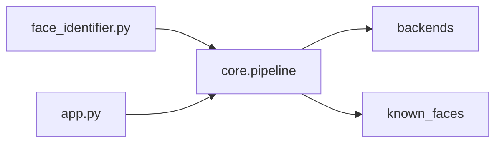

# py-rec — folder-based face identification

Identify people in photos using a **local gallery** of reference images. Two recognition stacks are supported: **dlib** (via the `face_recognition` package) and **InsightFace** (`buffalo_l` / `buffalo_sc`). A small **Streamlit** UI is included for single-image uploads; the **CLI** batch-processes files and writes face crops to disk.

---

## Quick start

**Prerequisites:** Python 3.9+ (3.12–3.13 recommended for broad wheel support), [uv](https://docs.astral.sh/uv/) or pip, and on macOS often **CMake** for building `dlib` (`brew install cmake`).

```bash
uv venv
uv sync --extra insightface   # installs base + InsightFace (recommended)
# If you don't need InsightFace at all:
# uv sync                     # base only: dlib + face_recognition + Pillow + Streamlit

source .venv/bin/activate     # optional; or use .venv/bin/python directly
```

> **Note on `uv sync`:** running a bare `uv sync` after installing `--extra insightface` **removes** the InsightFace extras (including `opencv-python-headless`, which provides `cv2`). If the UI suddenly reports `No module named 'cv2'`, you ran `uv sync` without the extra — just run `uv sync --extra insightface` again and restart Streamlit.

**CLI (batch):**

```bash
uv run python face_identifier.py                    # default: input_images/
uv run python face_identifier.py path/to/photo.jpg
uv run python face_identifier.py path/to/folder/
uv run python face_identifier.py --backend insightface --model-pack buffalo_sc
```

**Web UI (single image):**

```bash
uv run streamlit run app.py
```

Open the URL Streamlit prints (usually `http://localhost:8501`).

---

## Folder layout and naming

Everything is driven by directories next to the project root (or your current working directory when you run the app/CLI).

```
py-rec/
  known_faces/          ← YOU configure people here (not in the UI)
    Alice/
      ref1.jpg
      ref2.png
    Bob/
      frontal.jpg
  input_images/         ← default folder for CLI batch input
  unknown_faces/        ← CLI writes unmatched face crops here
  results/              ← CLI writes matched face crops here (by person name)
  face_identifier.py
  app.py
```

### `known_faces/` rules

| Rule | Detail |
|------|--------|
| **One subfolder = one person** | The **folder name** is the label returned by the model (e.g. `known_faces/Alice/` → label `Alice`). |
| **Names** | Use **no spaces** in folder names. Prefer `Alice_M`, `bob_smith`, or `CamelCase`. Stick to ASCII letters, digits, and underscores so paths stay portable. |
| **Photos per person** | Put **several** reference images (3–5) with varied pose/lighting when possible. One image works but is less reliable. |
| **Formats** | `.jpg`, `.jpeg`, `.png`, `.bmp`, `.webp` |
| **Do not mix** | Only real reference photos belong here. **Do not** put CLI output crops in `known_faces/` — matched outputs go to `results/<Name>/` so the gallery stays clean. |

### `input_images/`

Drop images (or folders of images) you want the **CLI** to process. The UI ignores this folder and uses the file you upload.

### `unknown_faces/` and `results/`

| Path | Contents |
|------|----------|
| `unknown_faces/` | Crops for faces **below** the match threshold (best guess still shown in logs/UI). |
| `results/<PersonName>/` | Crops for faces **accepted** as that person (same naming idea as before, but **not** mixed into `known_faces/`). |

---

## Models: when to use which

| Model id (UI) / CLI | Stack | Threshold meaning | Typical default | Notes |
|---------------------|--------|-------------------|-----------------|--------|
| `dlib` | `face_recognition` → dlib 128-d | **L2 distance** — *lower* is more similar; match if distance **≤** threshold | `0.6` | Easiest setup; good clear frontal photos. |
| `insightface:buffalo_l` | InsightFace pack `buffalo_l` | **Cosine similarity** in `[0,1]` — *higher* is more similar; match if similarity **≥** threshold | `0.5` | Stronger on hard images; first run downloads ONNX weights to `~/.insightface/models/`. |
| `insightface:buffalo_sc` | InsightFace pack `buffalo_sc` | Same as above | `0.4`–`0.5` | Lighter / CCTV-oriented; you may need a **lower** threshold than `buffalo_l` for the same accept rate. |

**Display “match %”** is derived from the backend (L2 vs cosine) and is **not** comparable across backends — use the raw **L2** or **cosine** line in the UI/verbose logs.

---

## Using the Streamlit UI

1. Put reference photos under `known_faces/<PersonName>/` as above.
2. Run `uv run streamlit run app.py`.
3. In the sidebar, choose **Model** (`dlib`, `insightface:buffalo_l`, or `insightface:buffalo_sc`), set **Tolerance**, and (for dlib) **Encoding jitters**.
4. Upload one image and click **Identify**.
5. For each detected face you get: **KNOWN / UNKNOWN**, best label, annotated full image + crop, match bar, raw metric vs threshold, timings, **Top-K candidates** table, and **Debug JSON** (box, embedding dim, score kind).

The UI **does not** edit the gallery; it only reads `known_faces/`.

---

## Using the CLI

```bash
# Defaults: backend dlib, tolerance 0.6, input_images/
uv run python face_identifier.py

# InsightFace + smaller pack
uv run python face_identifier.py --backend insightface --model-pack buffalo_sc --tolerance 0.45

# Stricter dlib (lower max distance)
uv run python face_identifier.py --tolerance 0.5 --num-jitters 5 --verbose
```

- **`--tolerance`:** omitted → **0.6** for dlib, **0.5** for InsightFace.
- **`--top-k`:** verbose logging / internal ranking of top person hypotheses (default 3).

---

## Developer guide

### Layout

| Path | Role |
|------|------|
| [`backends/base.py`](backends/base.py) | `FaceBox`, `MatchResult`, `FaceBackend` protocol (`load_image`, `detect_faces`, `encode_faces`, `find_best_match`, `rank_persons`). |
| [`backends/dlib_backend.py`](backends/dlib_backend.py) | dlib / `face_recognition` implementation. |
| [`backends/insightface_backend.py`](backends/insightface_backend.py) | InsightFace; implements `detect_and_encode` for one-pass detect+embed. |
| [`backends/__init__.py`](backends/__init__.py) | Registers backends; InsightFace is optional if deps missing. |
| [`core/pipeline.py`](core/pipeline.py) | `build_backend`, `load_known_faces`, `identify`, `known_faces_tree_mtime` — shared by CLI and UI. |
| [`face_identifier.py`](face_identifier.py) | Argparse + disk output (thin wrapper around `core.pipeline`). |
| [`app.py`](app.py) | Streamlit UI. |



### Adding a new backend

1. Add `backends/your_backend.py` implementing `FaceBackend` (all protocol methods, including `rank_persons`).
2. Register it in [`backends/__init__.py`](backends/__init__.py) `BACKENDS`.
3. Extend `build_backend` / `MODEL_IDS` in [`core/pipeline.py`](core/pipeline.py) and wire CLI flags + UI options.
4. Document threshold semantics in this README.

### Smoke test

```bash
uv run python face_identifier.py path/to/any_test.jpg --verbose
```

---

## Troubleshooting

| Issue | What to do |
|-------|------------|
| `dlib` / `face_recognition` won’t install | Install a C++ toolchain and CMake; on macOS: `xcode-select --install`, `brew install cmake`. |
| InsightFace not available in UI/CLI | Run `uv sync --extra insightface`. Without it, only `dlib` appears. |
| `No module named 'cv2'` when using InsightFace | A plain `uv sync` pruned the extras. Run `uv sync --extra insightface` and restart Streamlit. |
| First InsightFace run is slow | Models download to `~/.insightface/models/<pack>/`; needs network access. |
| SSL warning from `albumentations` | Often harmless version-check noise; identification still works. |
| Empty gallery | Ensure `known_faces/<Name>/` contains supported image files and at least one detectable face per photo. |

---

## License / data

You are responsible for **consent and privacy** when storing or processing people’s faces. Use this tool only where you have permission to do so.
